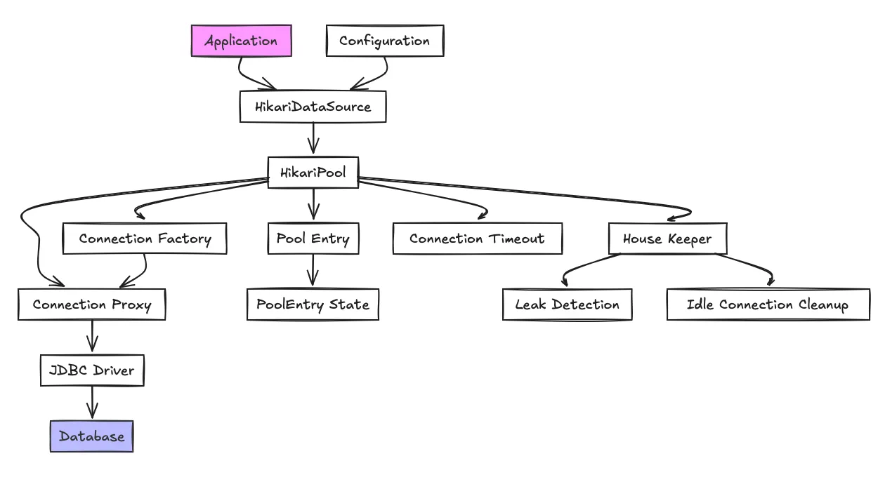

A **clean, production-grade Markdown user manual for HikariCP**.
It’s written as something you can **drop straight into a repo** (`HIKARI.md` or `docs/hikari.md`) and hand to teammates without embarrassment.

---

# HikariCP User Manual

**High-Performance JDBC Connection Pool**

---

## Table of Contents

1. [What is HikariCP?](#what-is-hikaricp)
2. [Why HikariCP](#why-hikaricp)
3. [How Connection Pooling Works](#how-connection-pooling-works)
4. [Installation & Dependencies](#installation--dependencies)
5. [Basic Configuration](#basic-configuration)
6. [Core Configuration Properties](#core-configuration-properties)
7. [Recommended Configurations](#recommended-configurations)
8. [Spring Boot Integration](#spring-boot-integration)
9. [Monitoring & Metrics](#monitoring--metrics)
10. [Connection Leak Detection](#connection-leak-detection)
11. [Performance Tuning Guide](#performance-tuning-guide)
12. [Common Pitfalls](#common-pitfalls)
13. [Production Checklist](#production-checklist)
14. [FAQ](#faq)

---

## What is HikariCP?

**HikariCP** is a **fast, lightweight, and reliable JDBC connection pool** for Java applications.

It manages a pool of reusable database connections so your application:

* Avoids expensive connection creation
* Scales efficiently under load
* Uses database resources responsibly

HikariCP is the **default connection pool in Spring Boot** and is widely used in high-throughput systems.

---

## Why HikariCP?

HikariCP was designed with one primary goal:

> **Be fast, predictable, and correct.**

### Key Advantages

* ⚡ Extremely low latency
* 🧠 Minimal configuration required
* 🔍 Strong leak detection support
* 🧱 Production-proven at scale
* 🔧 Sensible defaults that work out of the box

HikariCP avoids “feature bloat” and focuses on **doing one thing very well**.

---

## How Connection Pooling Works

Without pooling:

```
Request → Open DB Connection → Execute Query → Close Connection
```

With HikariCP:

```
Startup → Create Pool of Connections
Request → Borrow Connection → Execute Query → Return Connection
```

### Benefits

* Faster response times
* Reduced database load
* Predictable performance under concurrency
* Fewer connection-related failures

---

## Installation & Dependencies

### Maven

```xml
<dependency>
  <groupId>com.zaxxer</groupId>
  <artifactId>HikariCP</artifactId>
  <version>5.1.0</version>
</dependency>
```

### Gradle

```gradle
implementation "com.zaxxer:HikariCP:5.1.0"
```

> 💡 **Spring Boot users** do not need to add this explicitly — it’s included automatically.

---

## Basic Configuration

### Standalone Java Example

```java
HikariConfig config = new HikariConfig();
config.setJdbcUrl("jdbc:postgresql://localhost:5432/app");
config.setUsername("app_user");
config.setPassword("secret");
config.setMaximumPoolSize(10);

HikariDataSource dataSource = new HikariDataSource(config);
```

That’s it. You already have a production-ready pool.

---

## Core Configuration Properties

### Pool Size

| Property          | Description                                   |
| ----------------- | --------------------------------------------- |
| `maximumPoolSize` | Maximum number of connections in the pool     |
| `minimumIdle`     | Minimum number of idle connections kept alive |

```yaml
maximumPoolSize: 20
minimumIdle: 5
```

**Rule of thumb:**

```
maxPoolSize ≈ (CPU cores × 2) + effective DB concurrency
```

---

### Timeouts

| Property            | Description                                |
| ------------------- | ------------------------------------------ |
| `connectionTimeout` | Max wait time for a connection             |
| `idleTimeout`       | How long idle connections stay in the pool |
| `maxLifetime`       | Maximum lifetime of a connection           |

```yaml
connectionTimeout: 30000   # 30s
idleTimeout: 600000        # 10min
maxLifetime: 1800000       # 30min
```

> ⚠️ `maxLifetime` **must be shorter** than the database’s own connection timeout.

---

### Validation

HikariCP validates connections automatically — no manual test queries required.

Optional:

```yaml
validationTimeout: 5000
```

---

## Recommended Configurations

### Small / Low-Traffic Application

```yaml
maximumPoolSize: 10
minimumIdle: 2
connectionTimeout: 10000
idleTimeout: 300000
maxLifetime: 1800000
```

---

### Medium / API-Heavy Application

```yaml
maximumPoolSize: 30
minimumIdle: 10
connectionTimeout: 5000
idleTimeout: 60000
maxLifetime: 1200000
```

---

### High-Concurrency / Enterprise System

```yaml
maximumPoolSize: 50
minimumIdle: 20
connectionTimeout: 3000
idleTimeout: 30000
maxLifetime: 900000
```

---

## Spring Boot Integration

Spring Boot auto-configures HikariCP.

### `application.yml`

```yaml
spring:
  datasource:
    url: jdbc:postgresql://localhost:5432/app
    username: app_user
    password: secret
    hikari:
      pool-name: AppHikariPool
      maximum-pool-size: 20
      minimum-idle: 5
      connection-timeout: 30000
      idle-timeout: 600000
      max-lifetime: 1800000
```

No Java configuration required.

---

## Monitoring & Metrics

### Spring Boot Actuator

Add:

```xml
<dependency>
  <groupId>org.springframework.boot</groupId>
  <artifactId>spring-boot-starter-actuator</artifactId>
</dependency>
```

Enable metrics:

```yaml
management:
  endpoints:
    web:
      exposure:
        include: metrics
```

### Useful Metrics

| Metric                         | Meaning            |
| ------------------------------ | ------------------ |
| `hikaricp.connections.active`  | In-use connections |
| `hikaricp.connections.idle`    | Idle connections   |
| `hikaricp.connections.pending` | Threads waiting    |
| `hikaricp.connections.total`   | Total pool size    |

---

## Connection Leak Detection

Leak detection helps catch connections that were not returned.

```yaml
leak-detection-threshold: 2000
```

If a connection is held longer than the threshold, HikariCP logs a **stack trace** showing where it was acquired.

> ⚠️ Use leak detection **only in dev or troubleshooting** — it has runtime cost.

---

## Performance Tuning Guide

### DO

* Keep pool size reasonable
* Match pool size to DB capacity
* Monitor active vs pending connections
* Close connections promptly

### DON’T

* Oversize the pool “just in case”
* Use long-running transactions
* Share connections across threads
* Disable auto-commit carelessly

---

## Common Pitfalls

### ❌ Pool Too Large

Symptoms:

* DB CPU spikes
* Increased latency
* Lock contention

Fix:

* Reduce `maximumPoolSize`

---

### ❌ Connection Leaks

Symptoms:

* Pool exhaustion
* Increasing `pending` connections

Fix:

* Ensure every connection is closed
* Enable leak detection temporarily

---

### ❌ Wrong `maxLifetime`

Symptoms:

* Random connection failures

Fix:

* Set `maxLifetime` **below DB timeout**

---

## Production Checklist

* [ ] Pool size aligned with DB limits
* [ ] `maxLifetime` < DB connection timeout
* [ ] Metrics enabled
* [ ] Leak detection tested (disabled after)
* [ ] Load tested under peak traffic
* [ ] Logs reviewed for pool warnings

---

## FAQ

### Is HikariCP thread-safe?

Yes. It is fully thread-safe and designed for concurrent workloads.

### Should I manually validate connections?

No. HikariCP handles this internally.

### Is HikariCP reactive?

No. It is **blocking JDBC**, not reactive. Use R2DBC for reactive stacks.

### Is HikariCP suitable for microservices?

Absolutely — it’s one of the most common choices.

---

## Final Thoughts

HikariCP succeeds because it:

* Does **less**, but does it **better**
* Encourages **correct configuration**
* Makes performance **observable**

If your Java app talks to a database, **HikariCP is the right default choice**.

---

If you want, I can also:

* Turn this into **PDF / README / GitBook**
* Add **PostgreSQL-specific tuning**
* Add a **real-world sizing calculator**
* Write a **“HikariCP vs others” appendix**

Just say the word. 🚀
